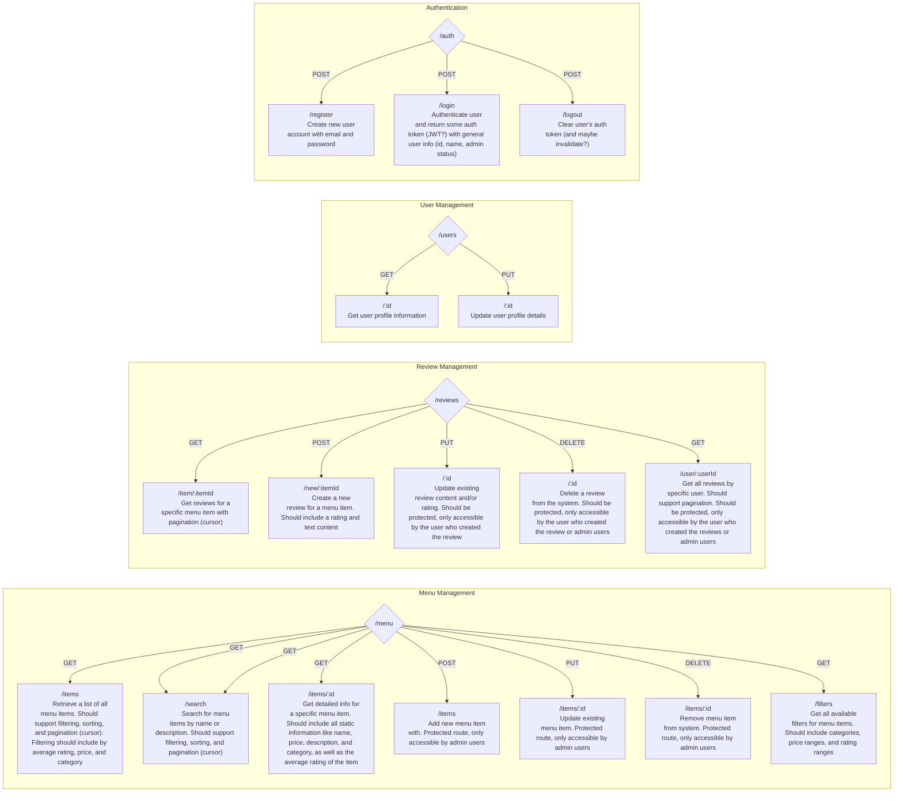

```mermaid
graph LR
    subgraph Menu Management
        menu{/menu}
        menu --> |GET| items["/items
            Retrieve a list of all menu items. Should support filtering, sorting, and pagination (cursor). Filtering should include by average rating, price, and category"]
        menu --> |GET| search["/popular
            Get the most popular items using some algorithm (Bayesian average?). Should support filtering by category"]
        menu --> |GET| search["/search
            Search for menu items by name or description. Should support filtering, sorting, and pagination (cursor)"]
        menu --> |GET| item["/items/:id
            Get detailed info for a specific menu item. Should include all static information like name, price, description, and category, as well as the average rating of the item"]
        menu --> |POST| addItem["/items
            Add new menu item with. Protected route, only accessible by admin users"]
        menu --> |PUT| updateItem["/items/:id
            Update existing menu item. Protected route, only accessible by admin users"]
        menu --> |DELETE| deleteItem["/items/:id
            Remove menu item from system. Protected route, only accessible by admin users"]
        menu --> |GET| filters["/filters
            Get all available filters for menu items. Should include categories, price ranges, and rating ranges"]
    end

    subgraph Review Management
        reviews{/reviews}
        reviews --> |GET| itemReviews["/item/:itemId
            Get reviews for a specific menu item with pagination (cursor)"]
        reviews --> |POST| addReview["/new/:itemId
            Create a new review for a menu item. Should include a rating and text content"]
        reviews --> |PUT| updateReview["/:id
            Update existing review content and/or rating. Should be protected, only accessible by the user who created the review"]
        reviews --> |DELETE| deleteReview["/:id
            Delete a review from the system. Should be protected, only accessible by the user who created the review or admin users"]
        reviews --> |GET| userReviews["/user/:userId
            Get all reviews by specific user. Should support pagination. Should be protected, only accessible by the user who created the reviews or admin users"]
    end

    subgraph User Management
        users{/users}
        users --> |GET| profile["/:id
            Get user profile information"]
        users --> |PUT| updateProfile["/:id
            Update user profile details"]
    end

    subgraph Authentication
        auth{/auth}
        auth --> |POST| register["/register
            Create new user account with email and password"]
        auth --> |POST| login["/login
            Authenticate user and return some auth token (JWT?) with general user info (id, name, admin status)"]
        auth --> |POST| logout["/logout
            Clear user's auth token (and maybe invalidate?)"]
    end
```